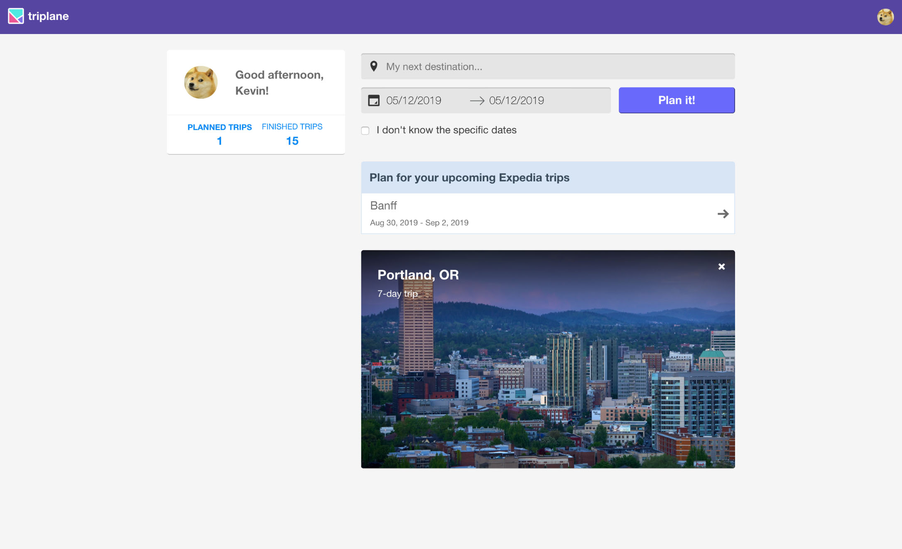
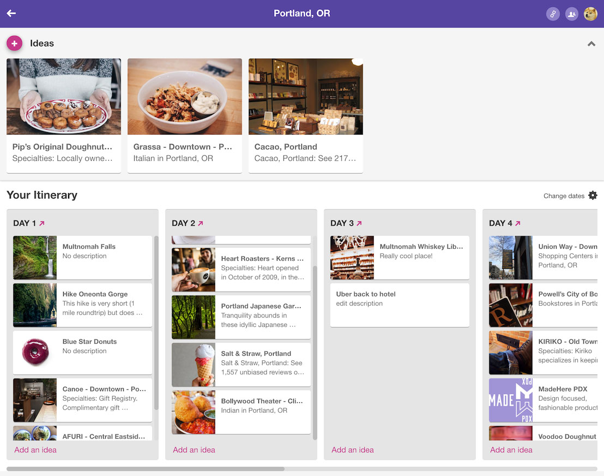

## RIP triplane

Triplane was a real-time, collaborative trip planner. It started out as a hackathon project and later turned into a very involved side project at Expedia. After building it, releasing it to the public, and maintaining it for 3+ years, I decided to lay it to rest as the cost of maintenance no longer made sense given the lack of traction. Rather than let it disappear completely, however, I decided to create this page to proudly showcase the product.

### Screenshots

### User Flows

Creating a new trip from scratch.

<iframe width="560" height="315"
src="https://www.youtube.com/embed/1T_8i-IFvY4" 
frameborder="0" 
allow="accelerometer; autoplay; encrypted-media; gyroscope; picture-in-picture" 
allowfullscreen></iframe>

Creating a new trip from existing Expedia bookings.

<iframe width="560" height="315"
src="https://www.youtube.com/embed/J9R3yGU7nhk" 
frameborder="0" 
allow="accelerometer; autoplay; encrypted-media; gyroscope; picture-in-picture" 
allowfullscreen></iframe>

Adding things to do cards to the trip.

<iframe width="560" height="315"
src="https://www.youtube.com/embed/VdrRF8vhuhQ" 
frameborder="0" 
allow="accelerometer; autoplay; encrypted-media; gyroscope; picture-in-picture" 
allowfullscreen></iframe>

Share an existing trip.

<iframe width="560" height="315"
src="https://www.youtube.com/embed/En-oud2sEv0" 
frameborder="0" 
allow="accelerometer; autoplay; encrypted-media; gyroscope; picture-in-picture" 
allowfullscreen></iframe>

Test-drive the app before signing up.

<iframe width="560" height="315"
src="https://www.youtube.com/embed/LUA7HYZYsZ8" 
frameborder="0" 
allow="accelerometer; autoplay; encrypted-media; gyroscope; picture-in-picture" 
allowfullscreen></iframe>
