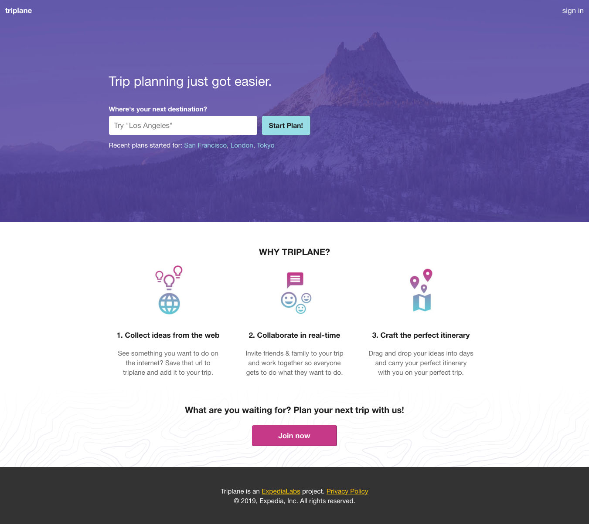

## RIP triplane (2015-2019)

Triplane was a real-time, collaborative trip planner. It started out as a hackathon project and later turned into a very involved side project at Expedia. I built it out of my own frustrations with using tools such as Google Sheets as a collaborative planning tool. Alas, after releasing it to the public through the [ExpediaLabs](https://www.prnewswire.com/news-releases/expedia-debuts-new-expedia-labs-showcase-for-developers-300313862.html) portal and maintaining it for three years, I decided to lay it to rest as the cost of maintenance no longer made sense given the lack of traction. Rather than let it disappear completely, I decided to create this page to showcase a snapshot of it in its final days.

### Screenshots

This is the home page for unauthenticated users.

This is what users see when they log in.

This is the main page for planning a trip. A combination of Pinterest plus Trello. Save stuff from all over the internet and drag and drop your way to a better itinerary.

### User Flow Videos

Creating a new trip from scratch.

<iframe width="560" height="315"
src="https://www.youtube.com/embed/1T_8i-IFvY4" 
frameborder="0" 
allow="accelerometer; autoplay; encrypted-media; gyroscope; picture-in-picture" 
allowfullscreen></iframe>

Adding things-to-do cards to the trip (two ways)

<iframe width="560" height="315"
src="https://www.youtube.com/embed/VdrRF8vhuhQ" 
frameborder="0" 
allow="accelerometer; autoplay; encrypted-media; gyroscope; picture-in-picture" 
allowfullscreen></iframe>

Creating a new trip from existing Expedia bookings.

<iframe width="560" height="315"
src="https://www.youtube.com/embed/J9R3yGU7nhk" 
frameborder="0" 
allow="accelerometer; autoplay; encrypted-media; gyroscope; picture-in-picture" 
allowfullscreen></iframe>

Share an existing trip, convert new users

<iframe width="560" height="315"
src="https://www.youtube.com/embed/En-oud2sEv0" 
frameborder="0" 
allow="accelerometer; autoplay; encrypted-media; gyroscope; picture-in-picture" 
allowfullscreen></iframe>

Unauthenticated trip planning, AKA try before you buy

<iframe width="560" height="315"
src="https://www.youtube.com/embed/LUA7HYZYsZ8" 
frameborder="0" 
allow="accelerometer; autoplay; encrypted-media; gyroscope; picture-in-picture" 
allowfullscreen></iframe>
